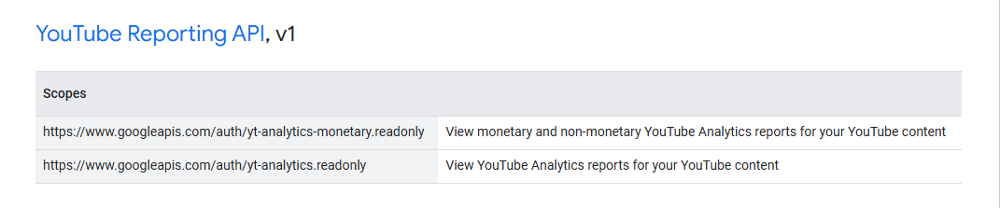

# tlns-google-oauth2

A server-side Google OAuth2 authentication with built in scopes for extra type safety.

## Generating scopes enums

Go to [Google's OAuth2 Scopes Listing](https://developers.google.com/identity/protocols/oauth2/scopes) and start copying from the first header to the final row of the table at the bottom of the document.  
  
  
Then pasting all of that to the `info.txt` and build the library, it will give you all possible scopes!

## Usage

```rust,ignore
use tlns_google_oauth2::GoogleOAuth2Client as Client;
use tlns_google_oauth2::scopes;
let client = Client::new("CLIENT_ID".to_string(), "CLIENT_SECRET".to_string(), "http://localhost:8080/callback".to_string()).expect("Failed to build client");
let auth = client.authorize_url(None, vec![&scopes::GoogleOAuth2APIv2::AuthUserinfoProfile]).unwrap();
let url = auth.0;
let csrf_token = auth.1;
let scopes = auth.2;

// ... Callback codes here (You can't save states in oauth2 crate for some reasons :( )

let code = "...";
let token = client.get_token(code.to_string()).await.unwrap();
// Do request stuff
```

## Credits

Thanks [`heapunderfl0w`](https://github.com/heapunderfl0w) for the proc macro idea instead of shitty Jinja2 implementation!
