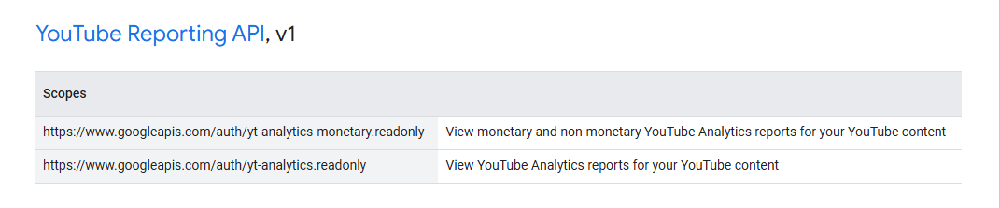

# tlns-google-oauth2

A server-side Google OAuth2 authentication with built in scopes for extra type safety.

## Generating scopes enums (for proc macro library part only)

Go to [Google's OAuth2 Scopes Listing](https://developers.google.com/identity/protocols/oauth2/scopes) and start copying from the first header to the final row of the table at the bottom of the document.


Then pasting all of that to the `info.txt` and build the library, it will give you all possible scopes!

## Usage ([`crate::grouped_scopes`])

```rust,should_panic
fn main() -> Result<(), Box<dyn std::error::Error>> {
    use tlns_google_oauth2::GoogleOAuth2Client as Client;
    use tlns_google_oauth2::grouped_scopes;
    use pollster::FutureExt as _;

    let client = Client::new("CLIENT_ID", "CLIENT_SECRET", "http://localhost:8080/callback")?;
    let auth = client.build_authorize_url(None, &[&grouped_scopes::GoogleOAuth2APIv2::AuthUserinfoProfile]);
    let url = auth.redirect_url;
    let csrf_token = auth.csrf_token;
    let scopes = auth.scopes;

    // ... Callback codes here (You can't save states in oauth2 crate for some reasons :( )

    let code = "...";
    let token = client.get_token(code, None).block_on()?;
    // Do request stuff
    Ok(())
}
```

## Usage ([`crate::scopes::Scopes`])

```rust,should_panic
fn main() -> Result<(), Box<dyn std::error::Error>> {
    use tlns_google_oauth2::GoogleOAuth2Client as Client;
    use tlns_google_oauth2::scopes;
    use pollster::FutureExt as _;

    let client = Client::new("CLIENT_ID", "CLIENT_SECRET", "http://localhost:8080/callback")?;
    let auth = client.build_authorize_url(None, &[&scopes::Scopes::AuthUserinfoProfile]);
    let url = auth.redirect_url;
    let csrf_token = auth.csrf_token;
    let scopes = auth.scopes;

    // ... Callback codes here (You can't save states in oauth2 crate for some reasons :( )

    let code = "...";
    let token = client.get_token(code, None).block_on()?;
    Ok(())
// Do request stuff
}
```

Yes, you can mix and match the slice with anything that implements [`ToGoogleScope`] trait.

## Credits

Thanks [`heapunderfl0w`](https://github.com/heapunderfl0w) for the proc macro idea instead of shitty Jinja2 implementation!
